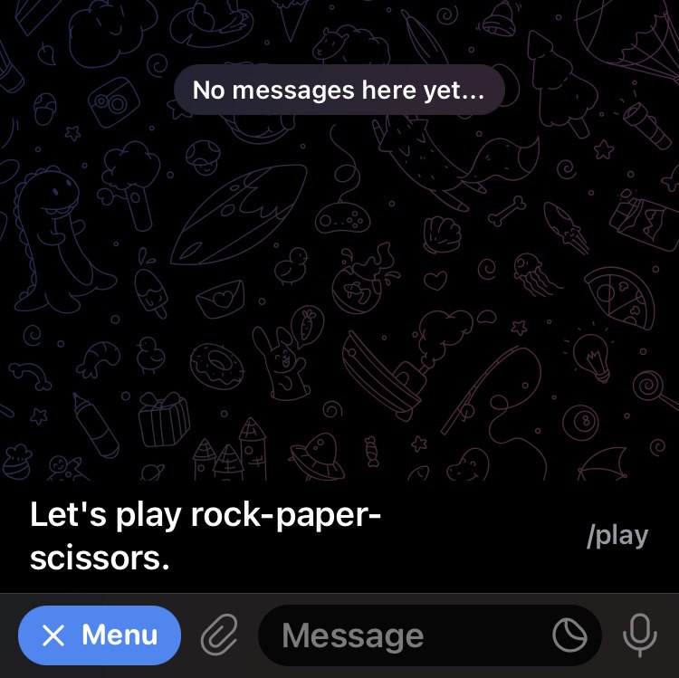
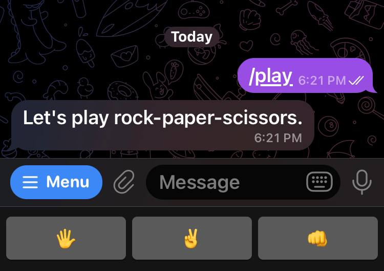
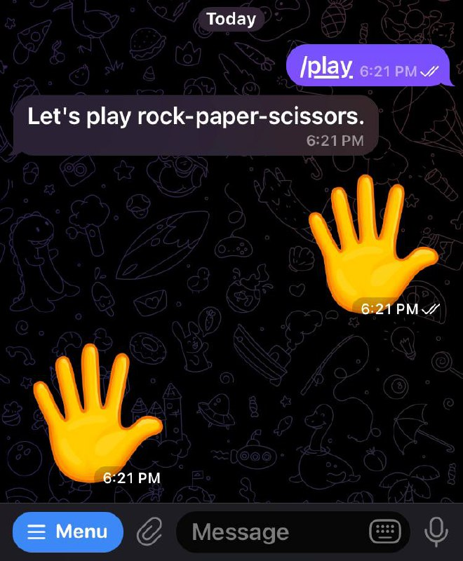

# Usage
Create a node js server and use telegram bot.

## Feature
- Rock-paper-scissors game
- Delete messages command in the menu
- Download the photo automatically when I send a photo to the bot
- Provide bot api for systems to send message to me and for testing the function of the telegram api.

---

## Installation
```cmd
npm i --save telegraf axios

```

---

## Rock-paper-scissors game in telegram
1. Click the menu button and choose 'Let's play rock-paper-scissors.'


2. You will send a command '/play' to the bot and 
it is waiting for your reply. Choose rock, paper or scissors in the reply keyboard button.


3. The bot will response automatically.


---

## Save photo automatically
https://core.telegram.org/bots/api#getfile

1. When I upload a photo, the bot on photo event can receive 
a parameter of file_id.

2. Call the telegram api with the file_id to get the file_path.  
https://api.telegram.org/bot<token>/getFile?file_id=<file_id>

3. Download the photo with the file_path.  
https://api.telegram.org/file/bot<token>/<file_path>

---

## Telegram api (keywords)
getUpdates  
sendMessage  

deleteWebhook  

CallbackQuery  
InlineKeyboardMarkup  
ReplyKeyboardMarkup  
ReplyKeyboardRemove  

setMyCommands  
deleteMyCommands

---

## My Related Project
PythonTelegram  
https://github.com/AppTimDev/PythonTelegram

---

# Reference

## Telegram Bot API (Bot API 6.3)
https://core.telegram.org/bots/api

## telegraf.js - v4.11.2
https://telegraf.js.org/#example
